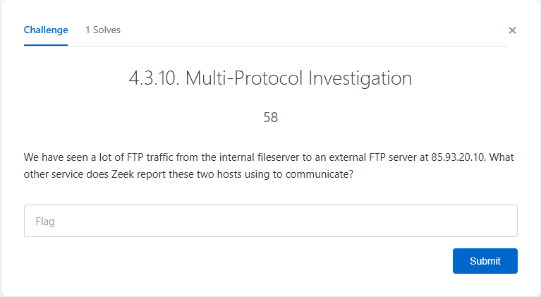
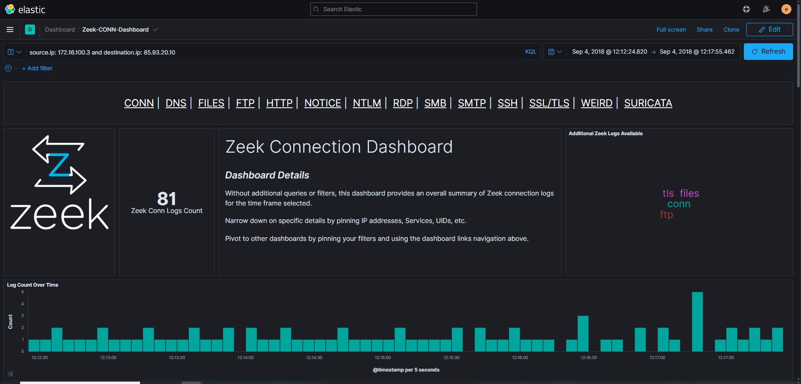
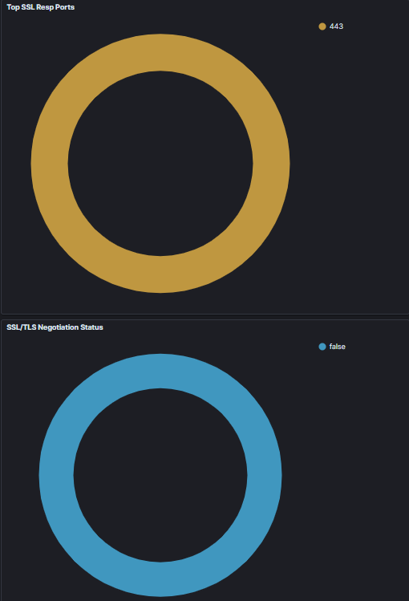

# Multi-Protocol Command & Control (C2) Detection

## Overview

Identified concurrent SSL/TLS encrypted sessions operating alongside FTP data exfiltration, indicating sophisticated command and control (C2) infrastructure. Demonstrated advanced protocol correlation skills to detect attacker operational security techniques.

## Scenario

During investigation of FTP data exfiltration between two hosts (172.16.100.3 and 85.93.20.10), additional protocol analysis revealed simultaneous encrypted communication channel, suggesting coordinated attack infrastructure.

## Tools Used

- **Elastic SIEM** - Multi-protocol correlation and analysis
- **Zeek** - Network traffic protocol identification
- **Zeek-FTP Dashboard** - Service field analysis

## Investigation Process

### 1. Initial FTP Analysis
- Started with Zeek-FTP Dashboard investigation
- Identified FTP traffic between source (172.16.100.3) and destination (85.93.20.10)

### 2. Protocol Expansion
- Removed FTP-only filter to view all traffic between hosts
- Query: `source.ip: 172.16.100.3 AND destination.ip: 85.93.20.10`
- Analyzed service field for additional protocols

### 3. C2 Channel Discovery
- **Finding:** SSL/TLS protocol detected alongside FTP traffic
- **Implication:** Encrypted command channel coordinating data exfiltration
- **Attack Sophistication:** Attacker used separate encrypted channel for C2 communications

### 4. Timeline Correlation
- SSL session established: Persistent long-duration connection
- FTP transfers: Intermittent data exfiltration events
- Pattern indicates SSL was controlling when/what to exfiltrate via FTP

## MITRE ATT&CK Mapping

- **T1071.001** - Application Layer Protocol: Web Protocols (SSL/TLS for C2)
- **T1041** - Exfiltration Over C2 Channel
- **T1048** - Exfiltration Over Alternative Protocol (FTP)
- **T1573** - Encrypted Channel (SSL/TLS)

## Skills Demonstrated

- Multi-protocol traffic correlation
- C2 infrastructure identification
- Understanding attacker operational security (OPSEC)
- Advanced filtering and query modification
- Behavioral analysis of coordinated attack techniques
- Recognizing encrypted command channels

## Threat Intelligence Insights

**Why SSL + FTP?**
- **SSL:** Encrypted C2 channel hides commands from detection
- **FTP:** Unencrypted data transfer (sometimes easier to establish)
- **Coordination:** SSL tells FTP what/when to exfiltrate
- **Defense Evasion:** Separating control and data channels complicates detection

## Conclusions

Successfully identified sophisticated multi-protocol attack infrastructure where SSL/TLS was used as an encrypted command and control channel to coordinate FTP data exfiltration. This investigation demonstrates ability to perform advanced protocol correlation, recognize attacker OPSEC techniques, and understand complex threat actor behavior beyond basic detection.

---

**Portfolio:** [github.com/paigealfred](https://github.com/paigealfred)

# Multi-Protocol Command & Control (C2) Detection

## Overview

Identified concurrent SSL/TLS encrypted sessions operating alongside FTP data exfiltration between the same two hosts, indicating sophisticated command and control (C2) infrastructure. Demonstrated advanced protocol correlation skills to detect attacker operational security techniques beyond single-protocol analysis.

## Lab Challenge

*Challenge 4.3.10: We have seen a lot of FTP traffic from the internal fileserver to an external FTP server at 85.93.20.10. What other service does Zeek report these two hosts using to communicate?*

## Scenario

During investigation of FTP data exfiltration between internal host 172.16.100.3 and external IP 85.93.20.10, expanded analysis revealed simultaneous encrypted SSL/TLS communication channel, suggesting coordinated attack infrastructure where encrypted C2 controlled the data exfiltration process.

## Tools Used

- **Elastic SIEM** - Multi-protocol correlation and traffic analysis
- **Zeek** - Network protocol identification and monitoring
- **KQL (Kibana Query Language)** - Multi-host traffic filtering

## Investigation Process

### 1. Query for All Traffic Between Hosts

*Opened Zeek-CONN-Dashboard and removed FTP-only filter. Executed query: `source.ip: 172.16.100.3 AND destination.ip: 85.93.20.10` to view all protocols between the two hosts*

### 2. Multi-Protocol Discovery

*Top Application Protocols panel revealed three concurrent protocols: FTP (72 connections), FTP-DATA (7 connections), and **SSL (2 connections)**. The presence of SSL alongside FTP indicated encrypted C2 coordination.*

### 3. SSL/TLS Connection Analysis

*Analyzed SSL/TLS connection characteristics: Port 443 usage and successful negotiation status confirmed persistent encrypted channel operating simultaneously with FTP data transfers*

## Key Findings

- **Answer:** SSL (Secure Sockets Layer / TLS)
- **Primary Protocol:** FTP (File Transfer Protocol) - 72 connections
- **Data Channel:** FTP-DATA - 7 active data transfers
- **C2 Channel:** SSL/TLS - 2 persistent encrypted connections on port 443
- **Source:** 172.16.100.3 (internal fileserver)
- **Destination:** 85.93.20.10 (external attacker infrastructure)
- **Attack Sophistication:** Dual-channel operation (encrypted control + unencrypted data)

## Timeline Correlation

**Concurrent Protocol Activity:**
- **SSL Session:** Long-duration persistent connection (command and control)
- **FTP Connections:** Multiple intermittent sessions (data exfiltration)
- **Pattern:** SSL connection established first, FTP transfers initiated after C2 commands received

**Operational Security Indicators:**
- Attacker used separate encrypted channel to hide commands
- FTP used for actual data transfer (easier to establish in some environments)
- SSL coordinated what files to exfiltrate and when
- Separating control and data channels complicates detection and attribution

## MITRE ATT&CK Mapping

- **T1071.001** - Application Layer Protocol: Web Protocols (SSL/TLS for C2)
- **T1041** - Exfiltration Over C2 Channel
- **T1048** - Exfiltration Over Alternative Protocol (FTP)
- **T1573** - Encrypted Channel (SSL/TLS for command obfuscation)
- **T1090** - Proxy (potential use of external infrastructure)

## Skills Demonstrated

- **Multi-Protocol Traffic Correlation** - Identifying relationships between concurrent protocols
- **C2 Infrastructure Detection** - Recognizing encrypted command channels
- **Advanced Query Techniques** - Removing default filters to expand investigation scope
- **Behavioral Analysis** - Understanding attacker operational security (OPSEC) techniques
- **Threat Intelligence Application** - Recognizing sophisticated attack patterns
- **Protocol Analysis** - Understanding why attackers choose specific protocol combinations

## Threat Intelligence Insights

**Why Use SSL + FTP Together?**

**SSL/TLS Channel (C2):**
- Encrypts command and control traffic
- Hides attacker commands from network monitoring
- Blends with legitimate HTTPS traffic
- Persistent connection for real-time control

**FTP Channel (Data Exfiltration):**
- Sometimes easier to establish outbound than HTTPS in restricted environments
- Can handle large file transfers efficiently
- Separate channel prevents C2 detection if FTP is blocked/monitored

**Attack Sophistication:**
- Most basic attacks use single protocol (FTP only)
- Advanced attackers separate control and data channels
- Demonstrates understanding of defensive monitoring capabilities
- Indicates organized threat actor with operational security awareness

## Technical Details

**Investigation Methodology:**
1. Identified heavy FTP traffic to external IP 85.93.20.10
2. Removed protocol-specific filter to view complete traffic picture
3. Executed targeted KQL query for all host-to-host communication
4. Analyzed service field to identify all protocols in use
5. Discovered concurrent SSL/TLS sessions alongside FTP
6. Correlated timing between SSL and FTP connections
7. Assessed port usage and connection patterns
8. Determined SSL was persistent C2 coordinating intermittent FTP transfers

**Filter Modification:**
- **Initial:** FTP dashboard with protocol=FTP filter
- **Expanded:** Removed filter, searched all protocols between hosts
- **Result:** Discovered hidden SSL/TLS communication layer

## Conclusions

Successfully identified sophisticated multi-protocol attack infrastructure where **SSL/TLS** served as encrypted command and control channel to coordinate FTP data exfiltration. This investigation demonstrates:

- Ability to perform advanced protocol correlation beyond single-protocol analysis
- Recognition of attacker OPSEC techniques and infrastructure design
- Understanding of why threat actors choose specific protocol combinations
- Skill in modifying search parameters to expand investigation scope
- Capability to identify covert communication channels in network traffic

**This level of analysis distinguishes between basic detection (finding FTP transfer) and advanced threat hunting (identifying the hidden C2 infrastructure controlling it).**

## Complete Attack Chain

1. **Initial Compromise** → Internal fileserver 172.16.100.3 compromised
2. **C2 Establishment** → SSL/TLS connection to 85.93.20.10:443 established
3. **Command Reception** → Attacker sends exfiltration commands via encrypted SSL
4. **File Access** → SMB protocol used to access target files internally (see related investigation)
5. **Data Exfiltration** → FTP transfers sensitive files to external infrastructure
6. **C2 Coordination** → SSL channel coordinates what/when to exfiltrate

## Related Investigations

- [FTP Data Exfiltration Investigation](https://github.com/paigealfred/ftp-exfiltration-investigation) - Initial discovery of FTP data theft
- [SMB Lateral Movement Investigation](https://github.com/paigealfred/smb-lateral-movement-investigation) - How attacker accessed files internally before exfiltration

---

**Portfolio:** [github.com/paigealfred](https://github.com/paigealfred)
